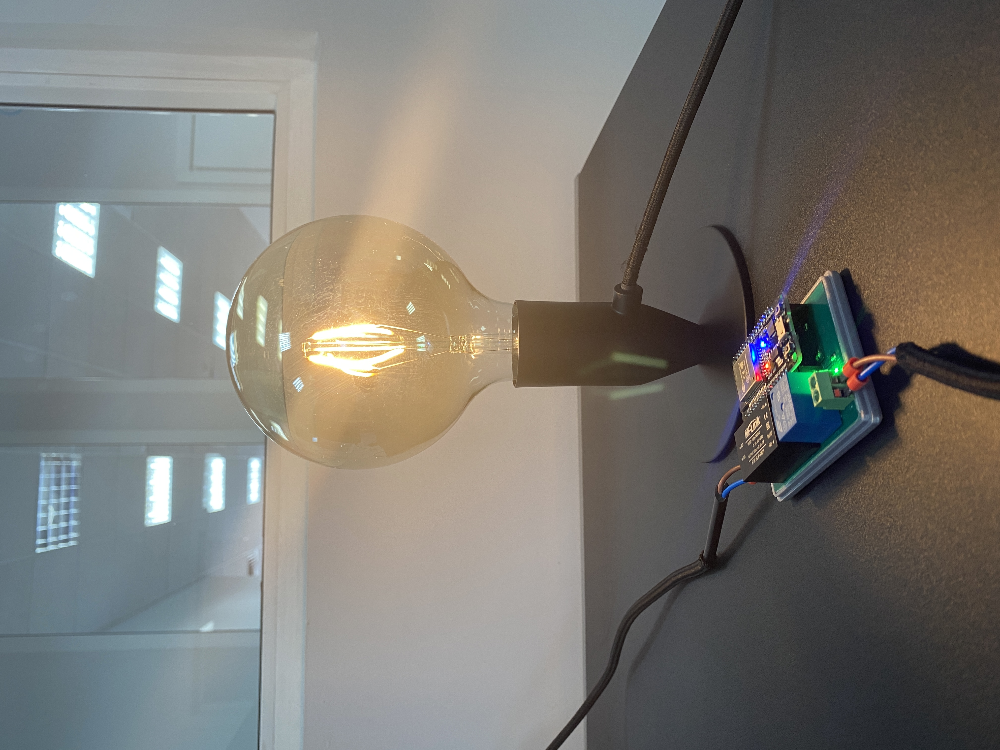

## 2Smart Relay

A custom Wi-Fi relay based on an ESP32 microcontroller. The device supports full integration with the mobile application [2Smart Cloud](https://2smart.com) on [IOS](https://apps.apple.com/ru/app/2smart-cloud/id1539188825) and [Android](https://play.google.com/store/apps/details?id=com.smart.microcloud.app&hl=ru&gl=US). 

With the help of the mobile application, you will be able to:
- connect the device to your account;
- switch the state of the relay;
- receive notifications;
- update the device firmware;
- control the device using voice assistants, telegram bot, phone calls;
- share access to device control with other users through a mobile application or a temporary link.

In addition to the control capabilities via a mobile application, the device has a full-fledged web interface available at the default address http://192.168.4.1 or at the device's address in the local network.

Materials for printing your own boards, accessories for the device, and 3d model can be found in the corresponding folders of this repository. 

The device firmware is developed based on the public [2Smart Cloud SDK](https://github.com/2SmartCloud/2smart-cloud-cpp-sdk) for ESP32.

### Connecting to the mobile application
After installing the firmware on the device, you need to install the mobile application [2Smart Cloud](https://2smart.com) and register. Then find the 2Smart Relay in the device market and follow the connection instructions. 





## How to write firmware on device

### Using Docker (Linux only)
1. Download our bash script:
    ```
    curl https://raw.githubusercontent.com/2SmartCloud/2smart-cloud-cpp-sdk/master/utils/bin/firmware_install.sh > firmware_install.sh
    ```

2. Make script executable:
    ```
    chmod +x firmware_install.sh
    ```
3. Have connected device to your computer.

4. Build and write the firmware
    ```
    ./firmware_install.sh write -d <PORT>
    ```
    or update existing firmware
    ```
    ./firmware_install.sh upload -d <PORT>
    ```
    full list of commands
    ```
    ./firmware_install.sh
    ```

5. If everything is okay it should start in AP mode and blink once in a second.

### Using installed requirements
1. Need have:
    `python` (>= v3) installed. You can control it in terminal
    ```
    python --version
    ```

    `platformio` (>= v5.1.1)
    ```
    pip install -U platformio
    ```

2. Have connected device to your computer.

3. Device should be listed in /dev as one of this:

    ```
    (Linux)
    /dev/ttyUSB0

    (OSX)
    /dev/cu.SLAB_USBtoUART
    /dev/cu.usbserial-0001
    ```

4. build and write

    ```
    pio run -t uploadfs
    pio run -t upload
    ```

    or just build
    ```
    pio run
    ```

5. If everything is okay it should start in AP mode and blink once in a second.

If you have error "can't open device "/dev/ttyUSB0": Permission denied" follow Link https://qna.habr.com/q/526674

CLI guide https://docs.platformio.org/en/latest/core/userguide/index.html

## Factory reset
To reset connected device press the power button for 10 seconds until led starts blynking. 

## Custom firmware

Fill free to fork this firmware and create you own products with custom functionality.
Detailed instruction you could find in our [blog](https://2smart.com/blog/tpost/ebvsii6y21-how-to-write-firmware-for-an-iot-device).


## To Do 
* [ ] Input for dry contact
* [ ] Normal closed contact
* [ ] Input for temperature sensor

